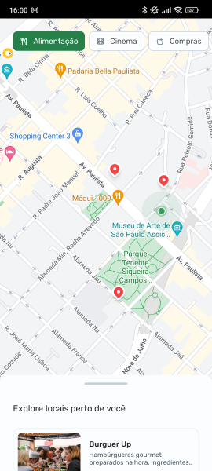

# Nearby (App)

O Nearby é um App (Mobile) para encontrar estabelecimentos próximos e usufruir de cupons de desconto, desenvolvido durante uma "Next Level Week", um evento gratuito da [Rocketseat 🚀](https://www.rocketseat.com.br).

Essa aplicação foi criada com intuito exclusivo de aprendizado e aprimoramento 😎.




## Stack utilizada

**ReactNative**, **Expo**, **Typescript**

~~Durante o desenvolvimento, utilizei meu próprio celular (Android), e também emuladores de Android (via AndroidStudio)

## Inicializando localmente o Back-end
Basta seguir as instruções que estão no repositório
[nearby-node](https://github.com/cicero-mello/nearby-node).

## Inicializando localmente o App

Clone o projeto:
```bash
  git clone https://github.com/cicero-mello/nearby-react-native.git
```

Entre no diretório do projeto:
```bash
  cd nearby-react-native
```

Instale as dependências:
```bash
  npm install
```

Em **src/services/api**, use seu IP privado no **baseURL** (o mesmo que é exibido no terminal após o start):
```bash
  export const api = axios.create({
    baseURL: "http://[SEU_IP]:3333",
    timeout: 700
})
```

Inicie o servidor:
```bash
  npm run start
```

Agora é só instalar o ExpoGo no seu celular, e ler o QRCode exibido no terminal! 🙂

## Observações

Embora a NWL tenha inserido "react-native-maps" nesse projeto, no Android, ele não será mais suportado pela "Nova Arquitetura" do Expo, ficando totalmente "deprecated" a partir do SDK53.

Esse projeto foi feito na SDK52, ainda assim, surgiram problemas que me levaram a mudar levemente uma características de UX para garantir seu funcionamento nos dispositivos Android (e também precisei inserir um breve delay no render inicial do mapa 😪)

Você pode obter mais informações sobre a "Nova Arquitetura" aqui:
https://expo.dev/changelog/2024/11-12-sdk-52

E, caso queira ver uma discussão sobre o problema... 👀
https://github.com/react-native-maps/react-native-maps/issues/5221
